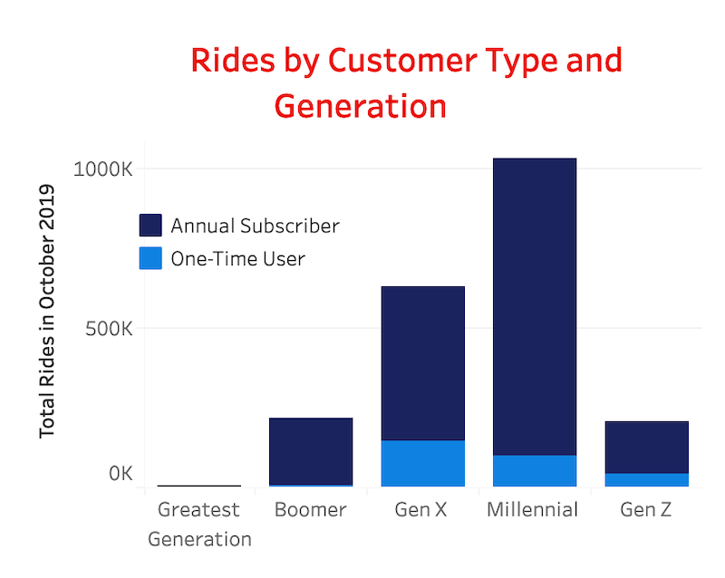

# CitiBike
CitiBike is a bicycle rental service in New York City that provides more than 15,000 bikes across the city for customers to rent. Bicycles can be checked out at any of 800 different stations in the city and returned to any other station. The company uses two categories to describe its users: subscribers and customers. For the purposes of clarity, I renamed the categories "annual subscribers" and "one-time users" respectively. 

I was curious to see what kinds of traffic patterns emerged at different times on different days of the week and whether the patterns differed based on user type and generation. To that end, I analyzed a dataset of more than 2 million trips made by CitiBike riders. 

## Step One: Obtain the Data
CitiBike has made its data publicly available at [CitiBike system data](https://www.citibikenyc.com/system-data). I chose to download data for Manhattan, Brooklyn, and Queens from October 2019.

## Step Two: Data Cleaning
Using the Pandas library in Python, I cleaned the data. Among other things, I dropped outliers and binned birth years into generational categories to make analysis by age more meaningful. [Jupyter Notebook](https://github.com/LBBL96/CitiBike/blob/master/Cleaning%20CitiBike%20data.ipynb)

## Step Three: Using Tableau for Visualization
I created an interactive series of maps and other visualizations highlighting traffic patterns by date and time, as well as by user type and generation. To interact with the maps and read my analysis, please visit my Tableau site at [Tableau Public](https://public.tableau.com/profile/lynn.leifker#!/vizhome/Citibike2_15771456575810/CitiBike).

## A Few Sample Visualizations

## Bike Rides by Day in October

## Distribution for One-Time Riders on October 1st

## Distribution for Subscribers on October 1st

## Peak Ride Times by Day

## Sample Day and Time (October 19th at noon) with Most Popular Stations

## Ride Length by Generation

## Ridership by Generation

